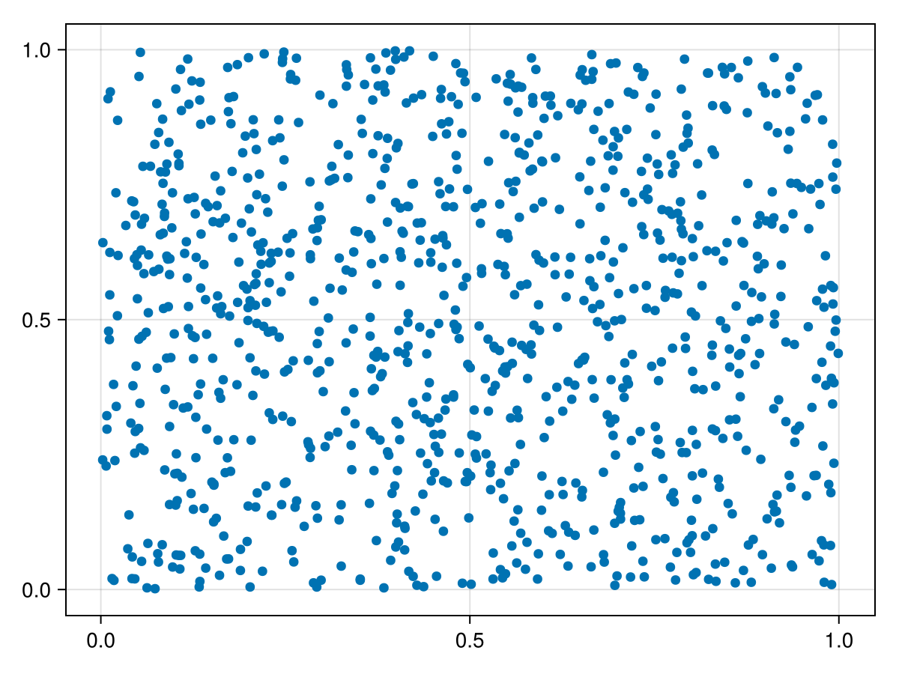
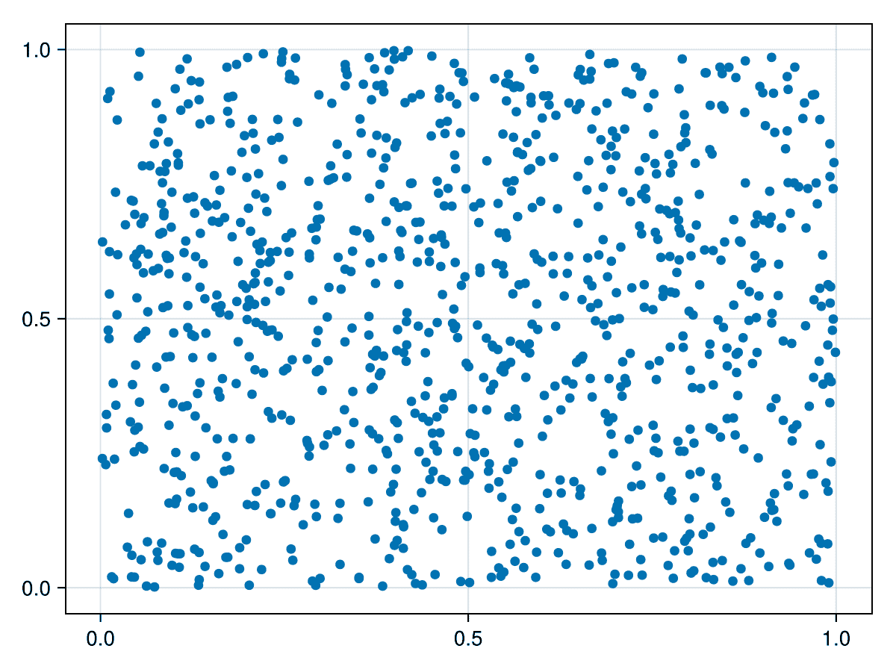

# LibImageQuant

[](https://github.com/ericphanson/LibImageQuant.jl/actions/workflows/CI.yml?query=branch%3Amain)
[](https://codecov.io/gh/ericphanson/LibImageQuant.jl)

A wrapper for `libimagequant` to easily and ergonomically perform color quantization on images in Julia.
This is particularly effective for reducing the size of plot PNGs as plots (in contrast to e.g. photographs) frequently use few distinct colors. LibImageQuant provides an extension for Makie so that `FigureLike` objects can be directly quantized (thanks to `colorbuffer`).

Note that color quantization is generally orthogonal to generic compression, and PNGFiles, the library used by default by CairoMakie, already has reasonable compression defaults. It's suggested to use the default of 256 colors unless you know the plot you're creating is particularly limited in its color variety, like the example shown here, otherwise the colors may be compromised.

## Quick example

```julia
using CairoMakie, LibImageQuant

fig = scatter(rand(1000), rand(1000))
save("test-original.png", fig)
save("test-256.png", quantize_image(fig))
save("test-8.png", quantize_image(fig; colors=8))
```

You can see the results here:

| Setting | File size | Result |
|---------|-----------|---------|
| Original (no quantization) | 249 KB |  |
| 256 colors (default) | 103 KB |  |
| 8 colors | 62 KB |  |

## TODO

- [ ] JLL: https://github.com/JuliaPackaging/Yggdrasil/pull/10853
- [x] use libimagequant C library to accept pixel matrix, retrieve palette & quantized image
- [x] convert to IndirectArray
- [x] tests
- [x] CairoMakie should test-only dep (or extension)
- [x] add kwargs corresponding to options exposed by `libimagequant`
