# LibImageQuant

[](https://github.com/ericphanson/LibImageQuant.jl/actions/workflows/CI.yml?query=branch%3Amain)
[](https://codecov.io/gh/ericphanson/LibImageQuant.jl)

A wrapper for `libimagequant` to easily and ergonomically perform color quantization on images in Julia.
This is particularly effective for reducing the size of plot PNGs as plots (in contrast to e.g. photographs) frequently use few distinct colors. LibImageQuant provides an extension for Makie so that `FigureLike` objects can be directly quantized (thanks to `colorbuffer`).

Note that color quantization is generally orthogonal to generic compression, and PNGFiles, the library used by default by CairoMakie, already has reasonable compression defaults. It's suggested to use the default of 256 colors unless you know the plot you're creating is particularly limited in its color variety, like the example shown here, otherwise the colors may be compromised.

## Quick example

Replace

```julia
save("my_figure.png", fig)
```

with

```julia
save("my_figure.png", quantize_image(fig))
```

for a smaller file size, at the cost of fewer colors being used in your image.

Here's a full example showing the `colors` keyword argument:

```julia
using CairoMakie, LibImageQuant, Random
# extra sharp images, uses more space though!
CairoMakie.activate!(px_per_unit=4, pt_per_unit=4)
Random.seed!(1)
fig = scatter(rand(1000), rand(1000))
save("assets/test-original.png", fig)
save("assets/test-256.png", quantize_image(fig))
save("assets/test-16.png", quantize_image(fig; colors=16))
save("assets/test-4.png", quantize_image(fig; colors=4))
save("assets/test-2.png", quantize_image(fig; colors=2))
```

You can see the results here:

| Setting                    | File size | Result                                |
| -------------------------- | --------- | ------------------------------------- |
| Original (no quantization) | 520 KB    |  |
| 256 colors (default)       | 213 KB    |     |
| 16 colors                  | 158 KB    | 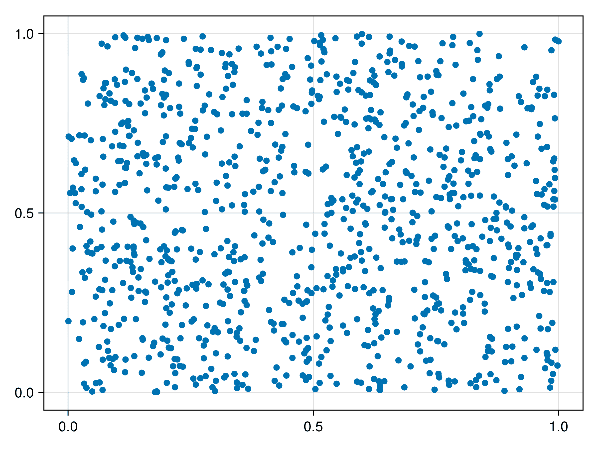      |
| 4 colors                   | 102 KB    | 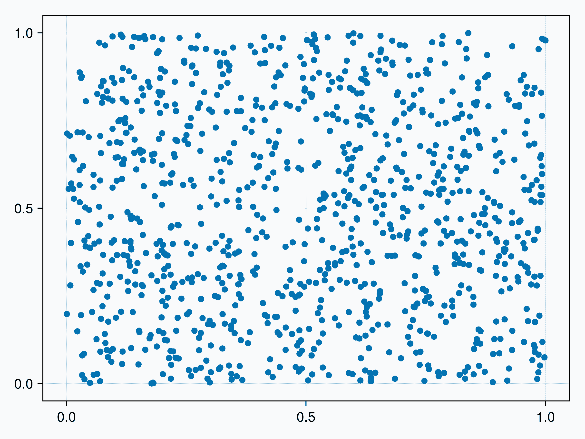        |
| 2 colors                   | 61 KB     | 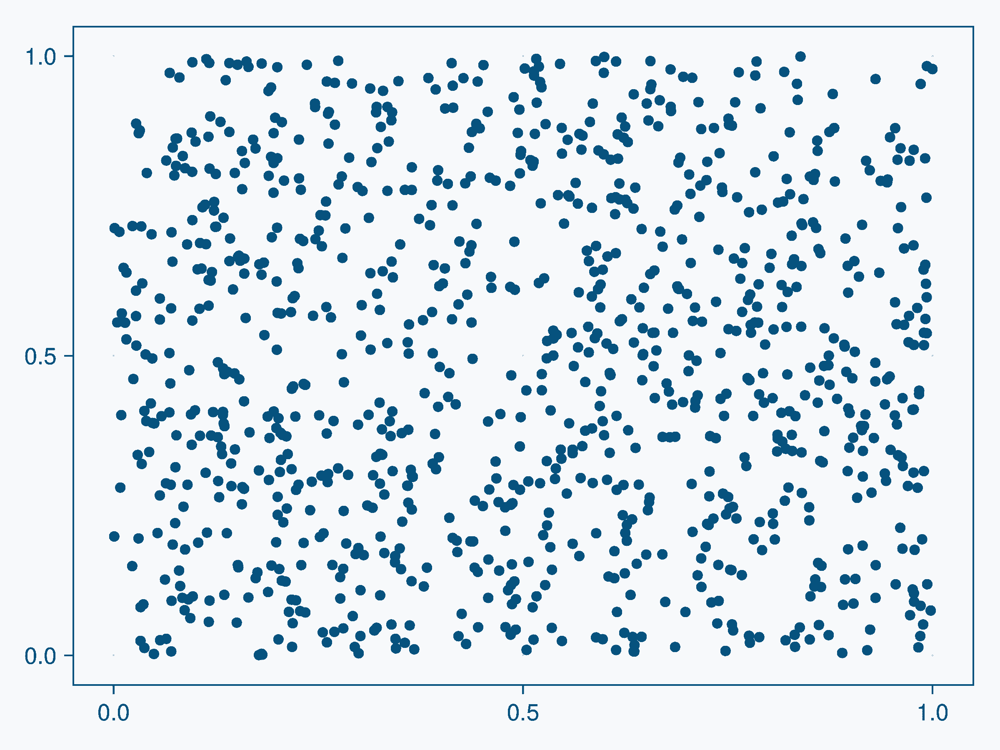        |

Or in plot form, with all 2 to 256 colors:

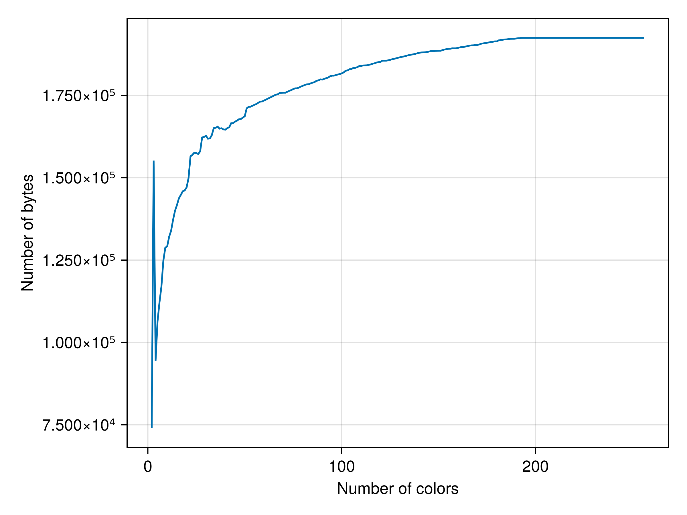

as produced by [./colors_vs-size.jl](./colors_vs_size.jl). I'm not sure why there's a big spike at 3 colors!

Likely 2/4/16/256 are good choices, since they correspond to the supported bit depths in PNGs.

Here's an example where color quantization does not work as well:

```julia
using CairoMakie, LibImageQuant, PNGFiles
CairoMakie.activate!(px_per_unit=1)
# https://ericphanson.com/photos/?photo=photos%2F2025%2F11%2FP1038134-0464108A
img = PNGFiles.load("heron.png")
img = rotr90(img)

fig = Figure(; size=size(img));
ax = Axis(fig[1,1], aspect = DataAspect())
hidedecorations!(ax)
image!(ax, img)

save("assets/heron-crop.png", colorbuffer(fig)[220:300, 600:700])
for n in [256, 16, 4, 2]
    save("assets/heron-$n.png", quantize_image(fig; colors=n))
    save("assets/heron-$n-crop.png", quantize_image(fig; colors=n)[220:300, 600:700])
end
```

| Setting                    | File size | Full image                                   | Crop                                              |
| -------------------------- | --------- | -------------------------------------------- | ------------------------------------------------- |
| Original (no quantization) | 2.5 MB    | 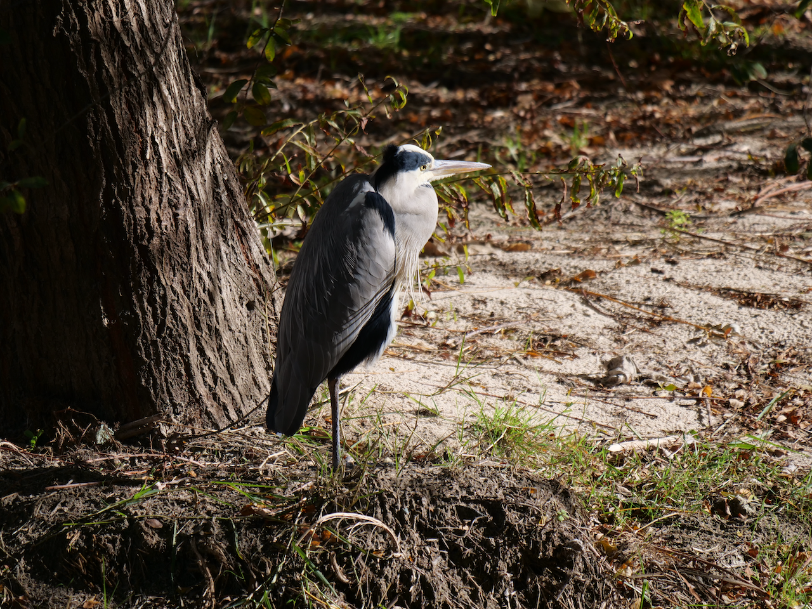     |      |
| 256 colors                 | 898 KB    | 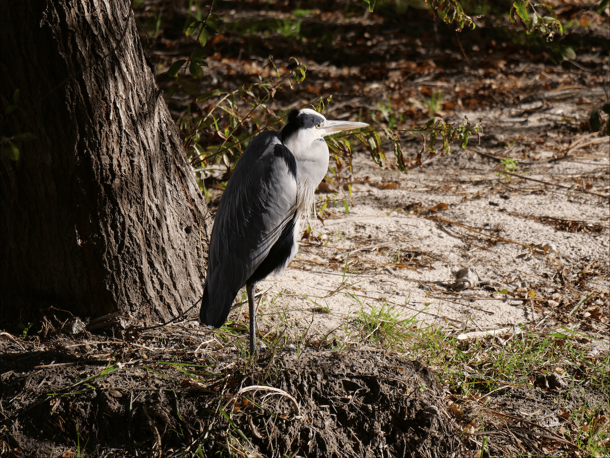 |  |
| 16 colors                  | 355 KB    | 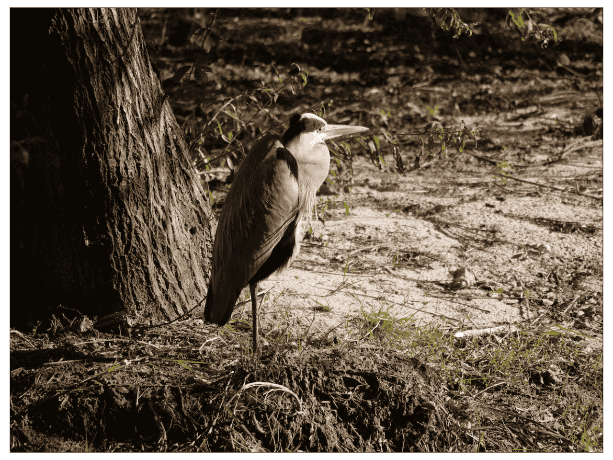  | 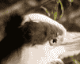  |
| 4 colors                   | 181 KB    | 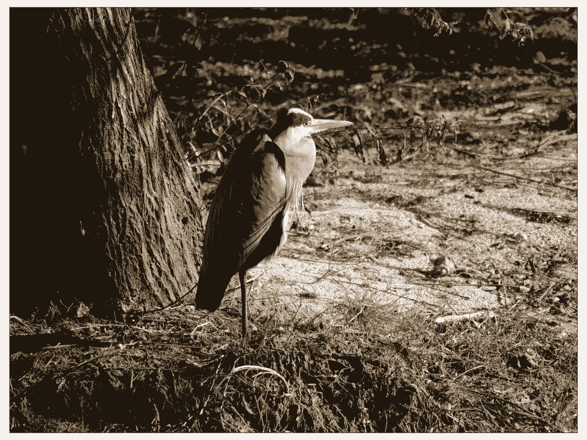   | 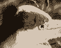   |
| 2 colors                   | 127 KB    | 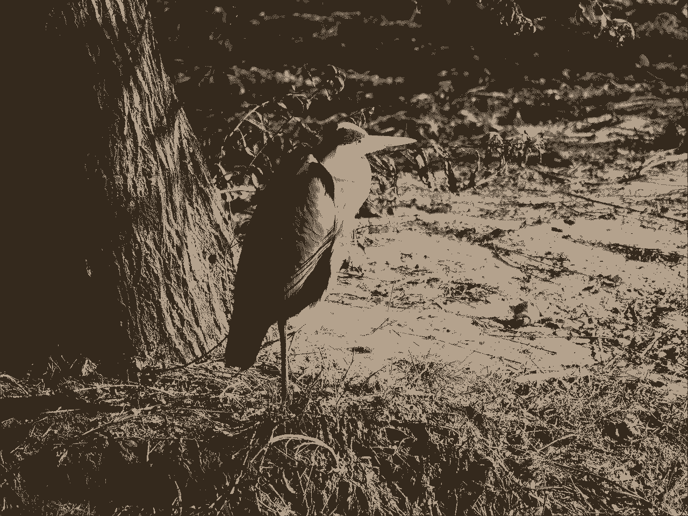   |    |

We can see already the 256-color version has visible degradation in the detailed areas around the heron's face.

## How it works

### Color palettes

Some image formats, including PNG, support custom color palettes. This allows using a fixed list of colors so that instead of storing (conceptually) `RGB(0.5, 0.75, 1.0)` over and over in the image (which is 3 bytes, or 4 with transparency) for every pixel of that color, you can (conceptually) define "color 1 is `RGB(0.5, 0.75, 1.0)`, and then just refer to "color 1". This is codified in Julia as an `IndirectArray` from [IndirectArrays.jl](https://github.com/JuliaArrays/IndirectArrays.jl), which internally stores both the value-lookup (list of colors) and array of indices into that value-lookup array.

For example, instead of `[RGB(0.5, 0.75, 1.0), RGB(0.5, 0.75, 1.0), RGB(0.5, 0.75, 1.0), RGB(0.75, 0.75, 1.0)]`, you can have `indices=[1, 1, 1, 2]` and `colors=[RGB(0.5, 0.75, 1.0), RGB(1.0, 0.75, 1.0)]`.

The real savings here is of course when you have few colors relative to the number of pixels in the image. And when you have _really_ few colors, you can use smaller integer types to store the indices. For example, if you have 256 or fewer colors, those can be stored in a single byte (instead of 3-4 bytes). The PNG format allows even down to 1 bit/pixel (i.e. 8 pixels in one byte) if you only have 2 colors.

Additionally, PNGs are compressed, meaning further savings are possible depending on the pattern of the indices themselves.

### Color quantization

Ok, so why do we need _this package_ if PNGs already support color palettes?

The first reason is plumbing: this package emits IndexedArrays that get passed to PNGFiles to trigger it to use the palette-based format in PNGs. Otherwise, a non-palette mode may be used when writing the PNG.

But the more important reason is that even if a plot is "conceptually" only a few colors (e.g. a scatter plot / line plot with black text and blue lines), it may be rendered with many more, due to anti-aliasing, blending, and things like that, which results in many slightly different versions of the colors. This library is a wrapper around [libimagequant](https://github.com/ImageOptim/libimagequant) which quantizes all these many variations back down to some fixed number of colors.

The number of colors can be specified in `quantize_image` via the `colors` keyword argument. It defaults to 256, which is the largest allowed number of colors for a palette-based image in PNG. This means we are defaulting to better image quality (more colors) at the cost of larger file size. That is because some plots can look _terrible_ if you use too few colors, and restricting to 256 can already help a lot with file size. However, for your particular plots you can experiment with reducing further.

## Inputs and outputs (and is this only for PNGs?)

LibImageQuant.jl supports:

- inputs: `AbstractMatrices` with `ColorTypes` entries (e.g. `Matrix{ColorTypes.ARGB32}` and similar)
  - special support is hooked in with a package extension for Makie to perform `matrix = colorbuffer(fig)` for you, so you can pass a `Makie.FigureLike` instead of a matrix
- outputs: `IndirectArray{ColorTypes.ARGB32}` matrices

Then those `IndirectArray`'s need to be consumed by a palette-using image writer, such as PNGFiles. The TIFF format also supports palettes, and [TiffImages.jl](https://github.com/tlnagy/TiffImages.jl) consumes IndirectArrays, so I expect it works there too, but I have not tested it.

Many other image formats, such as JPEGs, WebP, and AVIF, do _not_ support palette-based colors.

## API

The only API function of LibImageQuant.jl is `quantize_image`. See its docstring for details.

## TODO

- [ ] JLL: https://github.com/JuliaPackaging/Yggdrasil/pull/10853
- [x] use libimagequant C library to accept pixel matrix, retrieve palette & quantized image
- [x] convert to IndirectArray
- [x] tests
- [x] CairoMakie should test-only dep (or extension)
- [x] add kwargs corresponding to options exposed by `libimagequant`
